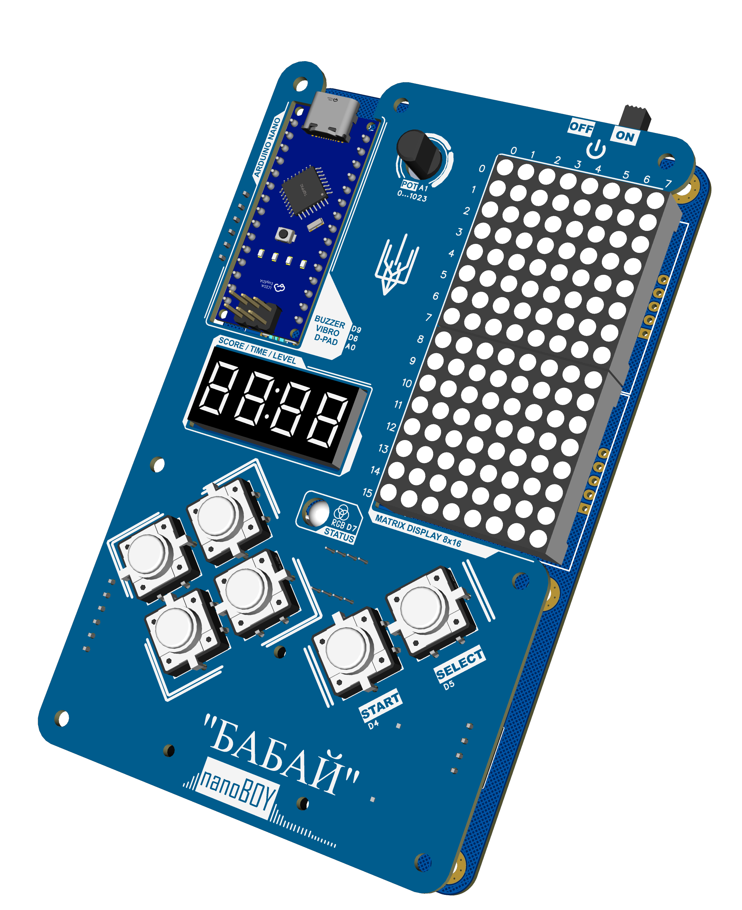

# ByByte NanoBoy - DIY educational handheld console

Ukrainian: [`README.uk.md`](README.uk.md)

**Babay nanoBoy** is a beginner-friendly STEM and game development learning kit from the ByByte series. It is intentionally **not** a polished commercial console: children solder through-hole parts and modules, assemble two boards, program simple games, and learn how pixel displays, inputs, timers, and sound fit together.

**Philosophy:** *Build, Play, Program, Learn.*

Related platform: the **ByByte Nano** educational robot ([ByByteNano repository](https://github.com/ByByte-diy/ByByteNano)) focuses on sensors, motors, and mobility; **nanoBoy** focuses on **2D games**, a **framebuffer mindset**, and **retro-style handheld play** (Game Boy / Arduboy-inspired, simplified).

---

## Key features

- **Beginner-friendly hardware:** through-hole where possible, ready-made modules, visible architecture (no SMD assembly required from children)
- **Two-board layout:** separate front UI panel and main electronics board
- **Low-resolution LED matrix display:** easy to reason about pixels, coordinates, and arrays
- **Secondary 7-segment display:** scores, timers, levels, counters
- **Open hardware:** schematic and PCB sources included in this repository
- **Programmable firmware:** Arduino Nano (ATmega328); sketches in the **Arduino IDE**. Official ByByte **Arduino libraries and examples** for nanoBoy (and other kits) live in **[ByByteLib](https://github.com/ByByte-diy/ByByteLib)**; you can still use additional community libraries (for example MAX7219 or TM1637) where needed, with wiring that matches this PCB.

---

## Hardware overview

| Area | Description |
|------|-------------|
| **MCU** | Arduino Nano (ATmega328P-compatible) |
| **Main display** | Two **MAX7219** 8x8 LED matrix modules combined into **8x16** monochrome pixels |
| **Aux. display** | **TM1637** four-digit 7-segment module |
| **Controls** | 4-way D-pad, **START**, **SELECT** (large 12x12 tactile switches) |
| **Audio** | Passive buzzer |
| **Extras** | **WS2812** status RGB LED, vibration motor, **potentiometer** (analog), battery voltage sense (resistor divider) |
| **Power** | Primary: USB; optional rechargeable 9 V path; reverse-polarity protection (Schottky), DC-DC regulation |

Typical games and demos: Snake, Tetris, Pong, racing, Arkanoid, simple pixel animations.

---

## Repository layout

| Path | Contents |
|------|----------|
| `hardware/schematics/SCH_main_board.pdf` | Main board schematic |
| `hardware/schematics/SCH_top_board.pdf` | Front / top panel schematic |
| `hardware/pcb/PCB_main_board.pdf` | Main board PCB |
| `hardware/pcb/PCB_top_board.pdf` | Front / top panel PCB |

Board renderings or photos can be placed under `img/` (for example `img/3D_main_board_pcb_1.png`).

---

## Software

- Use the **Arduino IDE** (or compatible toolchain) targeting **Arduino Nano** / ATmega328P.
- Install **ByByte firmware libraries** from **[ByByteLib](https://github.com/ByByte-diy/ByByteLib)** (copy the library folders into your Arduino `libraries` directory, or add a release ZIP via **Sketch - Include Library - Add .ZIP Library**, as described there).
- Write your own sketches or adapt the examples from that repo; match **pin assignments** to the schematic and board labels. Until a dedicated nanoBoy layer is published, you may combine **ByByteLib** with common drivers (MAX7219 matrix, TM1637, and your own button / analog code) as needed.

Educational progression the kit is designed around:

1. Blinking LEDs and basic output
2. Arrays and 2D coordinates
3. Drawing pixels and simple sprites
4. Collisions and game loops
5. Sound, timers, analog input
6. Optional: small engine patterns (state machines, entities)

---

## Technical specifications (high-level)

- **Logic:** 5 V ecosystem (Arduino Nano); follow the schematic for module rails.
- **Display:** 8x16 via MAX7219 chain; TM1637 for numeric UI.
- **Analog:** potentiometer on an ADC channel (per schematic).
- **Indicators:** WS2812 for status and effects; buzzer for tones; optional vibration feedback.

Refer to the PDFs under `hardware/` for exact nets, connectors, and part labels.

---

## Assembly notes

- Verify **polarity** and regulator outputs before first power-up; follow the schematic for **DC-DC** adjustment if your build uses adjustable modules. You will set correct voltage on your regulator before it was soldered. Will rotate potentiometer or solder correct jumper for set voltage to 5v.
- Use modest solder; keep through-hole leads tidy - this is a learner kit and should remain **easy to rework**.
- Complete **power checks** (diode, rails) before inserting expensive modules if possible.
- Keep leads **short and flush**: after soldering through-hole parts or modules, trim the leads as close to the PCB as practical so nothing sticks up. Long protruding leads can get in the way and can even cause scratches or minor injury.

---

## Troubleshooting

- **No display:** check MAX7219 **power**, **SPI-like wiring** (DIN, CLK, CS or LOAD per your routing), and module chain order.
- **TM1637 blank:** clock and data pins and 5 V; your sketch’s pin definitions must match the PCB.
- **No USB upload:** correct **board** and **port**; try another USB cable.
- **Odd analog readings:** common ground, reference voltage, pot wiring.
- **Noise on rails:** short leads, solid ground, adequate decoupling as per schematic.

---

## Contributing

Contributions are welcome:

1. Open an **issue** for bugs, documentation gaps, or lesson ideas
2. Improve examples and teaching notes
3. Fork, branch, and open a **pull request** for hardware, firmware examples, or documentation

---

## License

This project is released under the license specified in `LICENSE`.
